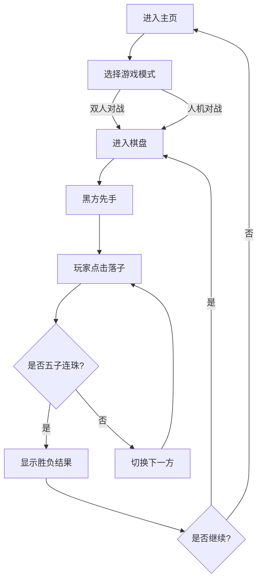

# 五子棋游戏 - 产品需求文档

## 1. 产品概述
一款精美的网页版五子棋游戏，支持双人对战和简单AI对手，具有优雅的视觉效果和流畅的交互体验。

## 2. 核心功能

### 2.1 用户角色
| 角色 | 核心权限 |
|------|----------|
| 玩家 | 开始游戏、落子、悔棋、重新开始 |

### 2.2 功能模块
1. **游戏主页**: 开始游戏界面、模式选择（双人对战 / 人机对战）
2. **棋盘游戏页**: 15×15 标准棋盘、落子、胜负判定、悔棋、重新开始

### 2.3 页面详情
| 页面名称 | 模块名称 | 功能描述 |
|----------|----------|----------|
| 游戏主页 | 模式选择 | 双人对战 / 人机对战按钮，带动画效果 |
| 游戏主页 | 标题展示 | 游戏标题及装饰性背景 |
| 棋盘游戏页 | 棋盘 | 15×15 标准棋盘，带坐标标注 |
| 棋盘游戏页 | 落子 | 点击交叉点落子，黑白交替，带落子动画和音效 |
| 棋盘游戏页 | 胜负判定 | 五子连珠高亮，弹出胜负结果 |
| 棋盘游戏页 | 游戏控制 | 悔棋、重新开始、返回主页按钮 |
| 棋盘游戏页 | 状态显示 | 当前轮到哪方落子 |

## 3. 核心流程

## 4. 用户界面设计

### 4.1 设计风格
- **主题**: 日式禅意风格，模拟真实围棋棋盘质感
- **主色调**: 暖木色（棋盘），黑白（棋子），金色点缀（连珠高亮）
- **按钮风格**: 圆角，带悬停效果和轻微阴影
- **字体**: 使用优雅的等宽字体和装饰性标题字体
- **布局**: 居中棋盘，顶部状态栏，底部控制按钮

### 4.2 页面设计概览
| 页面名称 | 模块名称 | UI元素 |
|----------|----------|--------|
| 游戏主页 | 标题展示 | 大号标题，水墨风格装饰背景，淡入动画 |
| 游戏主页 | 模式选择 | 两个大按钮，悬停放大，点击涟漪效果 |
| 棋盘游戏页 | 棋盘 | 暖色木质纹理背景，网格线，星位标记，坐标 |
| 棋盘游戏页 | 落子动画 | 棋子落下缩放+阴影效果，最后一手标记 |
| 棋盘游戏页 | 胜负弹窗 | 居中弹窗，背景模糊，连珠高亮线，结果文字 |

### 4.3 响应式
- 桌面端优先设计
- 棋盘自适应屏幕大小
- 触屏优化：增大点击区域
