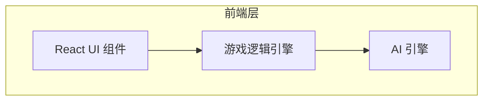

# 五子棋游戏 - 技术架构文档

## 1. 架构设计



## 2. 技术说明
- 前端: React@18 + TailwindCSS@3 + Vite
- 初始化工具: Vite
- 后端: 无（纯前端游戏）
- 数据存储: React State（本地状态管理）

## 3. 路由定义
| 路由 | 用途 |
|------|------|
| / | 游戏主页 |
| /game | 棋盘游戏页 |

## 4. 数据模型

### 4.1 游戏状态定义

```typescript
// 棋盘状态
type CellState = 'empty' | 'black' | 'white';
type Board = CellState[][]; // 15x15

// 游戏模式
type GameMode = 'pvp' | 'pve';

// 游戏状态
interface GameState {
  board: Board;
  currentPlayer: 'black' | 'white';
  gameMode: GameMode;
  gameOver: boolean;
  winner: 'black' | 'white' | null;
  winningCells: [number, number][];
  moveHistory: [number, number][];
}
```

## 5. 核心游戏逻辑

### 5.1 胜负判定
从最后落子位置出发，检查四个方向（水平、垂直、两条对角线）是否有连续五个同色棋子。

### 5.2 AI 逻辑（简单版）
- 评估每个空位的分数（周围己方棋子数 - 对方棋子数）
- 选择分数最高的位置落子
- 优先堵截对方的四子连线
